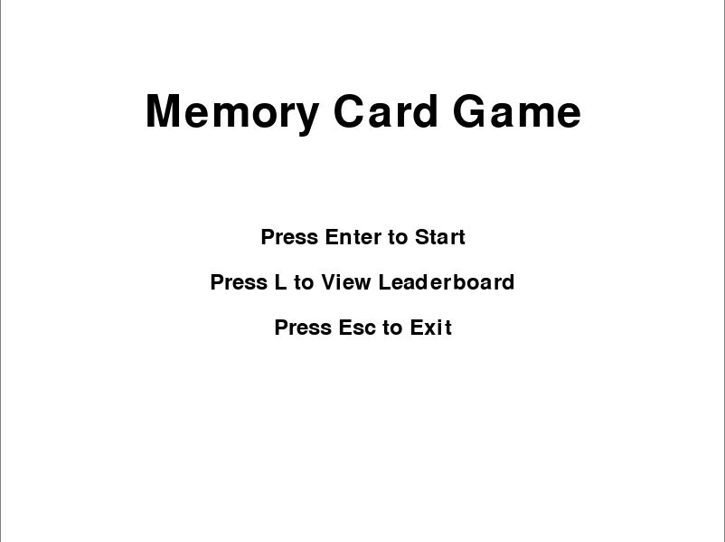

# Advanced Memory Card Game

## Overview

This is an advanced memory card game built with Python and Pygame. The game challenges players to match pairs of colored cards on a grid within the fewest attempts and shortest time possible. The game includes three difficulty levels: Easy, Medium, and Hard.

## Features

- **Multiple Difficulty Levels:** Choose between Easy (4x4), Medium (6x4), and Hard (6x6) grid sizes.
- **Animated Card Flipping:** Smooth animations when cards are flipped.
- **Scoring System:** Scores are based on time taken and the number of attempts.
- **Hints:** Limited hints to reveal all cards briefly.
- **Leaderboard:** Track the best score for each difficulty level.

